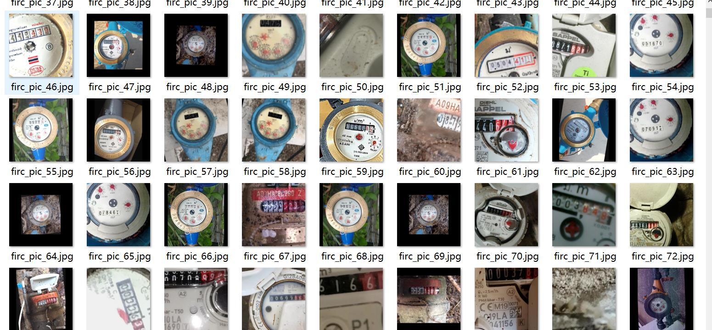
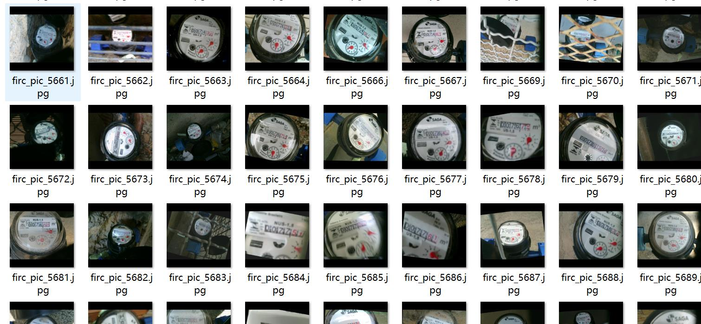
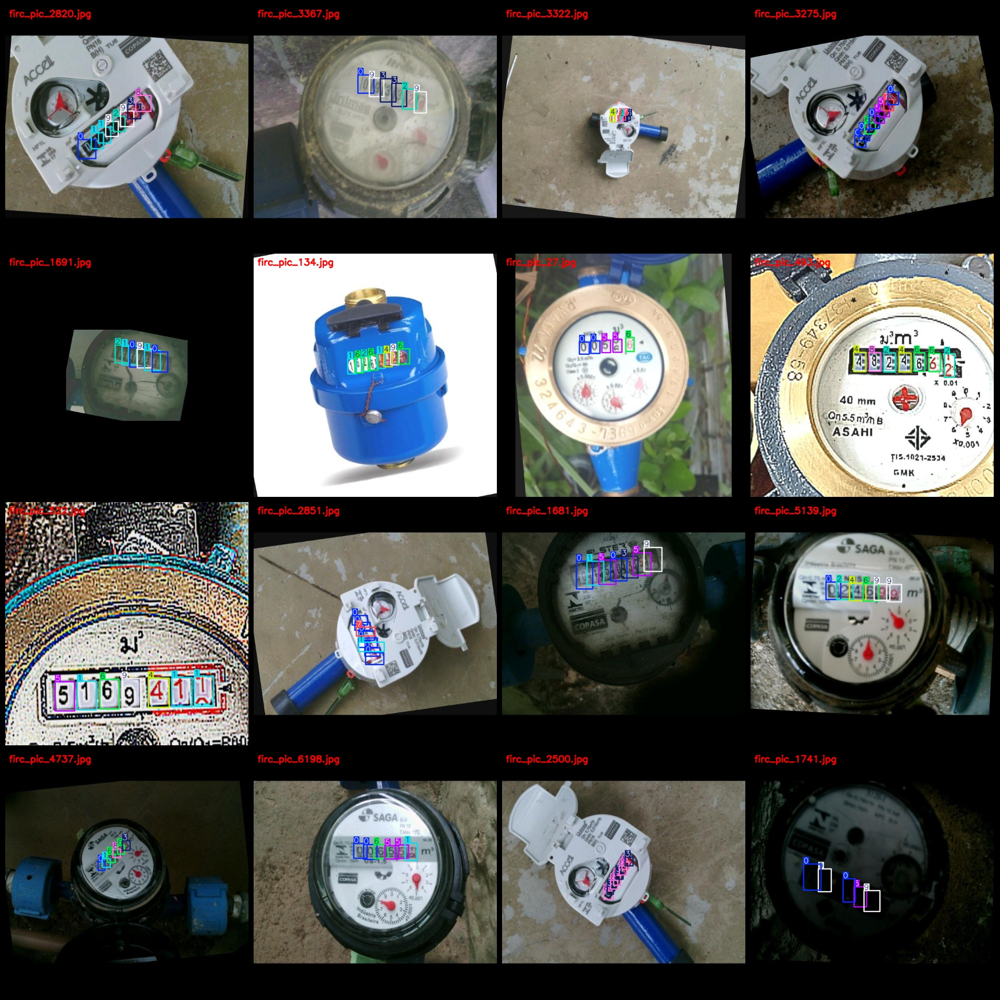
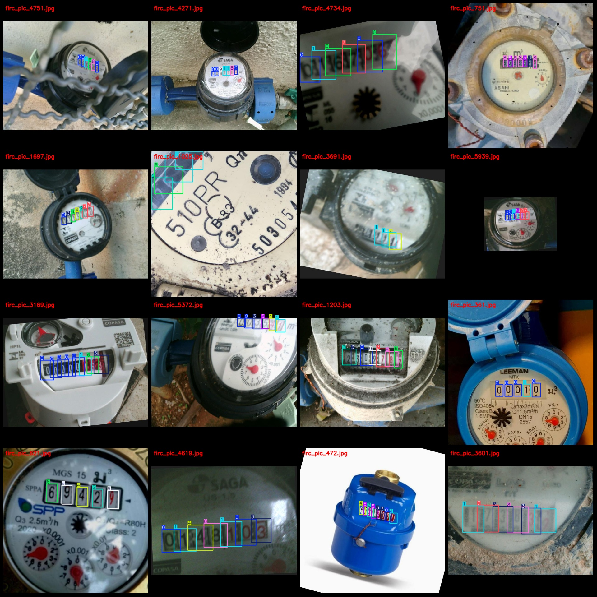

# Smart Meter OCR Readings Detection Dataset for Different Meters: Electric Meter, Water Meter, Air Pressure Meter in VOC+YOLO Format with 6316 Images in 10 Categories

The dataset format is Pascal VOC format + YOLO format. It does not include the split path of the txtfile, but only contains the jpgimage and corresponding VOC format xmlfile and yolo format txtfile.
number of images: 6316  
annotation count: 6316  
annotation count: 6316  
annotationnumber of classes: 10  
Annotation class names (Note that the order of yolo format classes does not correspond to this, but is based on labels file's 'classes.txt' as follows): ["0", "1", "2", "3", "4", "5", "6", "7", "8", "9"]
boxes per class:   
0 box count = 10419  
1 box count = 4399  
2 box count = 3564  
3 box count = 3099  
4 box count = 3148  
5 box count = 3004  
6 box count = 2963  
7 box count = 3104  
8 box count = 3206  
9 box count = 3136  
total boxes: 40042  
images per class:   
0 images = 5330  
1 images = 3206  
2 images = 2738  
3 images = 2414  
4 images = 2514  
5 images = 2350  
6 images = 2354  
7 images = 2409  
8 images = 2394  
9 images = 2352  
image resolution: 640x640  
Use the annotation tool: labelImg.
Annotation rules: draw a rectangle box around the class.
Important note: The dataset has not been split into training, validation, and test sets. You need to do that yourself.
Special Disclaimer: This dataset does not guarantee the accuracy of the trained model or the weights file.
Image preview:
## Images

Here is a pay link on Stripe ( https://buy.stripe.com/3cs8yP7sY87d0vu9AB ). Please contact me lonlonago@foxmail.com after funding $89, and I will send you a complete data files , thank you!

